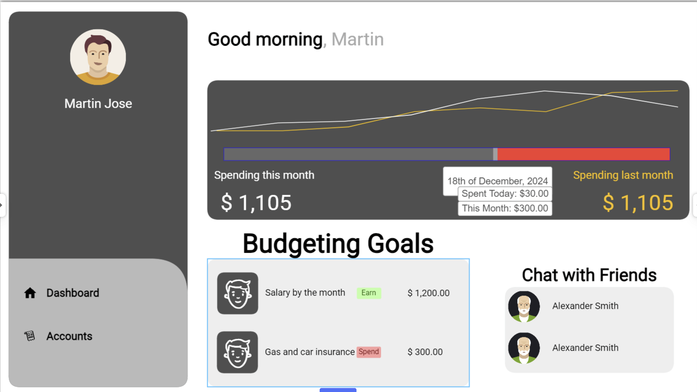
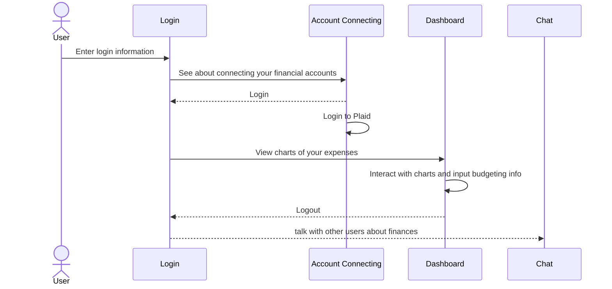

# Expenses Easy

[My Notes](notes.md)

This app will allow you to connect your bank accounts and track your expenses. For whatever reason, other apps that do this are hard to follow, only show one graph at a time and don't allow you to just see the basic transcation information that you want to. This app will focus on tracking expenses, allowing you to see your transactions on graphs; showing daily transactions or whatever time frequency the user desires. 

## 🚀 Specification Deliverable

Expenses Easy lets you easily access your financial accounts, track expenses, and provide budgeting tools.

For this deliverable I did the following. I checked the box `[x]` and added a description for things I completed.

- [x] Proper use of Markdown
- [x] A concise and compelling elevator pitch
- [x] Description of key features
- [x] Description of how you will use each technology
- [x] One or more rough sketches of your application. Images must be embedded in this file using Markdown image references.

### Elevator pitch

Worried about tracking your expenses? But every app makes no sense and you can't actually see what you want? Yeah I agree. Expenses Easy will let you see useful information about your bank accounts with a focus on your transaction history which will help you to track your expenses, and if wanted, start budgeting.

### Design

Simple diagram showing that the user will login, then access Plaid (the api that allows you to access your banking information), then see their charts and budgeting tools, and finally be able to use the chat to communicate with other users.

### Key features

- Login and logout features to allow you to access your same information different devices.
- Connect your bank and investment accounts
- Interactive graphs that allow for easy access to track your expenses
- Ability to set and track budgeting goals

### Technologies

I am going to use the required technologies in the following ways.

- **HTML** - Have just two pages. One where you access your banking stuff with Plaid and the other page with the graphs and budegeting tools.
- **CSS** - I want to have interactive and beautiful graphs that help you see easily your daily expenses.
- **React** - Description here
- **Service** - Endpoints for authenticationn and storing user inputted data. Also, access to Plaid, an API that lets you access your banking data.
- **DB/Login** - Store user inputted budgeting data as well as keeping accesss to their Plaid API key.
- **WebSocket** - Provide the chat to allow users to talk to each other

## 🚀 AWS deliverable

For this deliverable I did the following. I checked the box `[x]` and added a description for things I completed.

- [x] **Server deployed and accessible with custom domain name** - [My server link](https://easyexpenses.click/).

## 🚀 HTML deliverable

For this deliverable I did the following. I checked the box `[x]` and added a description for things I completed.

- [x] **HTML pages** - Three different pages. One just home/login page (index.html), the dashboard page (dashboard.html), and a page to fix your connected bank accounts (accounts.html).
- [x] **Proper HTML element usage** - I spent a lot of time learning about elements. I used header, footer, main, nav, img, a, fieldset, input, button, form, and many more.
- [x] **Links** - There are links between each page. Its part of the navigation
- [x] **Text** - Text is displayed for the dashboard of the user and the accounts page has detail since it is kind of like an about page.
- [x] **3rd party API placeholder** - The accounts page has the login for Plaid which is the 3rd party API that I will be using to connect the users accounts.
- [x] **Images** - I didn't put many images because there will mainly be CSS displaying graphs and stuff like that but there is my logo plastered on the website.
- [x] **Login placeholder** - Placeholder for auth on the login/home page and also for the login required for Plaid on the accounts page.
- [x] **DB data placeholder** - The budgeting goals will be saved in the database and the progress for each goal as well.
- [x] **WebSocket placeholder** - I want to have a chat so you can ask for financial advice from your friends. That is what the placeholder chatbox is (named Chap box in my html).

## 🚀 CSS deliverable

For this deliverable I did the following. I checked the box `[x]` and added a description for things I completed.

- [x] **Header, footer, and main content body** - I used a styling css file
- [x] **Navigation elements** - Bootstrap NavBar with adjustments
- [x] **Responsive to window resizing** - Bootstrap and `display:flex' did most the work here. I literally spent hours making this work properly
- [x] **Application elements** - I used a lot of display:flex to get things to align correctly.
- [x] **Application text content** - Set text to Times New Roman
- [x] **Application images** - My logo appears on the connected accounts page. Also I added github icon at the bottom.

## 🚀 React part 1: Routing deliverable

For this deliverable I did the following. I checked the box `[x]` and added a description for things I completed.

- [x] **Bundled using Vite** - Easy to install and use Vite.
- [x] **Components** - Easy to bring the code over from HTML and CSS, but had to rework them quite a bit.
- [x] **Router** - Easy to creating the component routing.

## 🚀 React part 2: Reactivity

For this deliverable I did the following. I checked the box `[x]` and added a description for things I completed.

- [x] **All functionality implemented or mocked out** - Localstorage used to track user and there is mock storage usage for what will be info pulled from DB. There is also functionality for adding goals and mock chatting.
- [x] **Hooks** - Extensive use of useState and useEffect to provide functionality.

## 🚀 Service deliverable

For this deliverable I did the following. I checked the box `[x]` and added a description for things I completed.

- [ ] **Node.js/Express HTTP service** - I did not complete this part of the deliverable.
- [ ] **Static middleware for frontend** - I did not complete this part of the deliverable.
- [ ] **Calls to third party endpoints** - I did not complete this part of the deliverable.
- [ ] **Backend service endpoints** - I did not complete this part of the deliverable.
- [ ] **Frontend calls service endpoints** - I did not complete this part of the deliverable.

## 🚀 DB/Login deliverable

For this deliverable I did the following. I checked the box `[x]` and added a description for things I completed.

- [ ] **User registration** - I did not complete this part of the deliverable.
- [ ] **User login and logout** - I did not complete this part of the deliverable.
- [ ] **Stores data in MongoDB** - I did not complete this part of the deliverable.
- [ ] **Stores credentials in MongoDB** - I did not complete this part of the deliverable.
- [ ] **Restricts functionality based on authentication** - I did not complete this part of the deliverable.

## 🚀 WebSocket deliverable

For this deliverable I did the following. I checked the box `[x]` and added a description for things I completed.

- [ ] **Backend listens for WebSocket connection** - I did not complete this part of the deliverable.
- [ ] **Frontend makes WebSocket connection** - I did not complete this part of the deliverable.
- [ ] **Data sent over WebSocket connection** - I did not complete this part of the deliverable.
- [ ] **WebSocket data displayed** - I did not complete this part of the deliverable.
- [ ] **Application is fully functional** - I did not complete this part of the deliverable.
